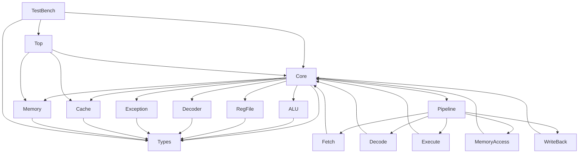

# RISC-V BSV处理器项目

## 项目简介

本项目是基于Bluespec SystemVerilog (BSV)实现的RISC-V处理器，采用模块化设计，支持基本的RISC-V指令集。项目使用BSV进行硬件描述，并提供了完整的测试环境。

## 项目架构

```
riscv-bsv-processor/
├── Makefile                # 构建脚本，集成BSV和RISC-V工具链
├── firmware/               # 存放编译后的固件文件
├── scripts/                # 辅助脚本，如链接脚本
│   └── link.ld            # RISC-V链接脚本
├── src/                    # 源代码目录
│   ├── common/            # 公共类型和定义
│   │   └── Types.bsv      # 基本数据类型和指令格式定义
│   ├── core/              # 处理器核心模块
│   │   ├── ALU.bsv        # 算术逻辑单元
│   │   ├── Core.bsv       # 处理器核心主模块
│   │   ├── RegFile.bsv    # 寄存器文件
│   │   ├── Decoder.bsv    # 指令解码器（待实现）
│   │   └── Exception.bsv  # 异常处理单元（待实现）
│   ├── memory/            # 内存子系统
│   │   ├── Cache.bsv      # 缓存实现（待实现）
│   │   └── Memory.bsv     # 内存控制器（待实现）
│   ├── pipeline/          # 流水线模块（待实现）
│   │   ├── Fetch.bsv      # 指令获取阶段
│   │   ├── Decode.bsv     # 指令解码阶段
│   │   ├── Execute.bsv    # 执行阶段
│   │   ├── Memory.bsv     # 内存访问阶段
│   │   └── WriteBack.bsv  # 写回阶段
│   └── soc/               # 系统级模块
│       ├── TestBench.bsv  # 测试平台，用于仿真和验证
│       └── Top.bsv        # 顶层模块（待实现）
└── tests/                 # 测试用例
    ├── assembly/          # 汇编测试程序
    │   └── simple_test.s  # 简单的汇编测试
    ├── c/                 # C语言测试程序（待实现）
    └── verification/      # 验证脚本（待实现）
```

## 模块关系图



## 模块说明

### 1. Types模块 (src/common/Types.bsv)
- 定义了基本数据类型，如Word、Addr等
- 定义了RISC-V指令格式结构
- 定义了处理器状态枚举

### 2. Core模块 (src/core/Core.bsv)
- 处理器核心主模块
- 实现基本的指令获取和执行流程
- 包含程序计数器和处理器状态管理

### 3. ALU模块 (src/core/ALU.bsv)
- 算术逻辑单元实现
- 支持基本的算术、逻辑和移位操作

### 4. RegFile模块 (src/core/RegFile.bsv)
- 寄存器文件实现
- 支持RISC-V的32个通用寄存器
- 处理x0寄存器特殊行为（硬连线为0）

### 5. TestBench模块 (src/soc/TestBench.bsv)
- 测试平台，用于仿真和验证
- 实例化处理器核心
- 提供仿真控制和输出

## 构建和仿真

### 编译项目
```bash
make compile
```

### 运行仿真
```bash
make simulate
```

### 清理构建文件
```bash
make clean
```

## 开发计划

### 第一阶段：基础功能完善
1. 完成内存子系统实现
   - 实现基本的内存控制器
   - 添加内存访问接口
2. 实现指令解码器
   - 完整支持RISC-V基础指令集
   - 添加指令类型识别和操作数提取
3. 添加异常处理机制
   - 实现基本异常检测
   - 设计异常响应流程

### 第二阶段：性能优化
4. 实现流水线设计
   - 五级流水线（取指、译码、执行、访存、写回）
   - 处理数据冒险和控制冒险
5. 添加缓存系统
   - 指令缓存和数据缓存
   - 实现缓存替换策略
6. 实现分支预测
   - 基本的静态/动态分支预测
   - 分支目标缓冲区

### 第三阶段：功能扩展
7. 扩展指令集支持
   - 完整实现RV32I指令集
   - 添加M扩展（乘法和除法）
   - 考虑添加C扩展（压缩指令）
8. 完善系统功能
   - 中断和异常处理
   - 特权级支持
   - 内存管理单元（MMU）

### 第四阶段：测试与验证
9. 添加更多测试用例
   - 完善汇编测试程序
   - 添加C语言测试程序
   - 实现自动化验证脚本
10. 性能评估与优化
    - 性能基准测试
    - 功耗和面积优化
    - 时序优化
