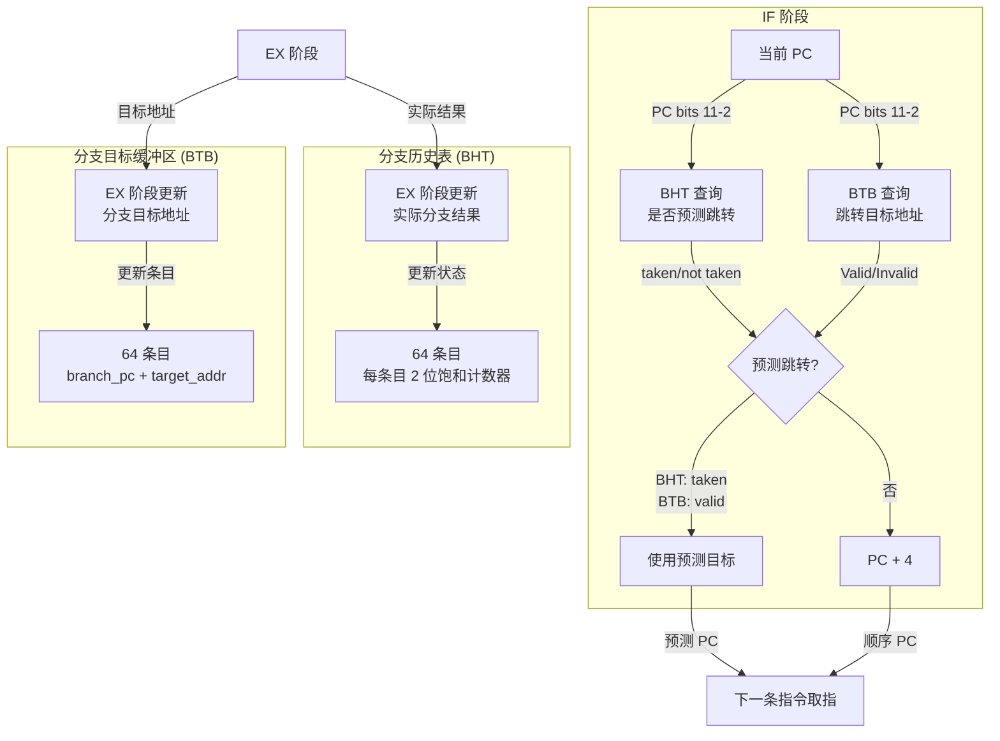
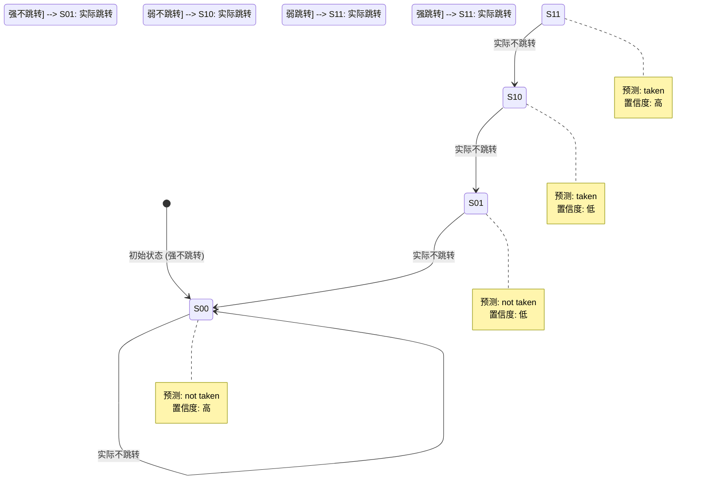
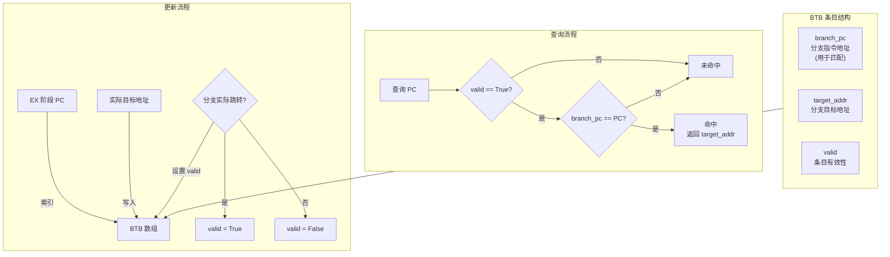
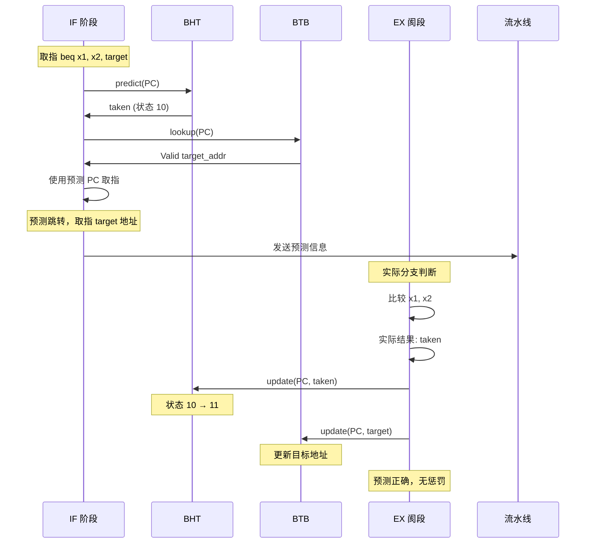
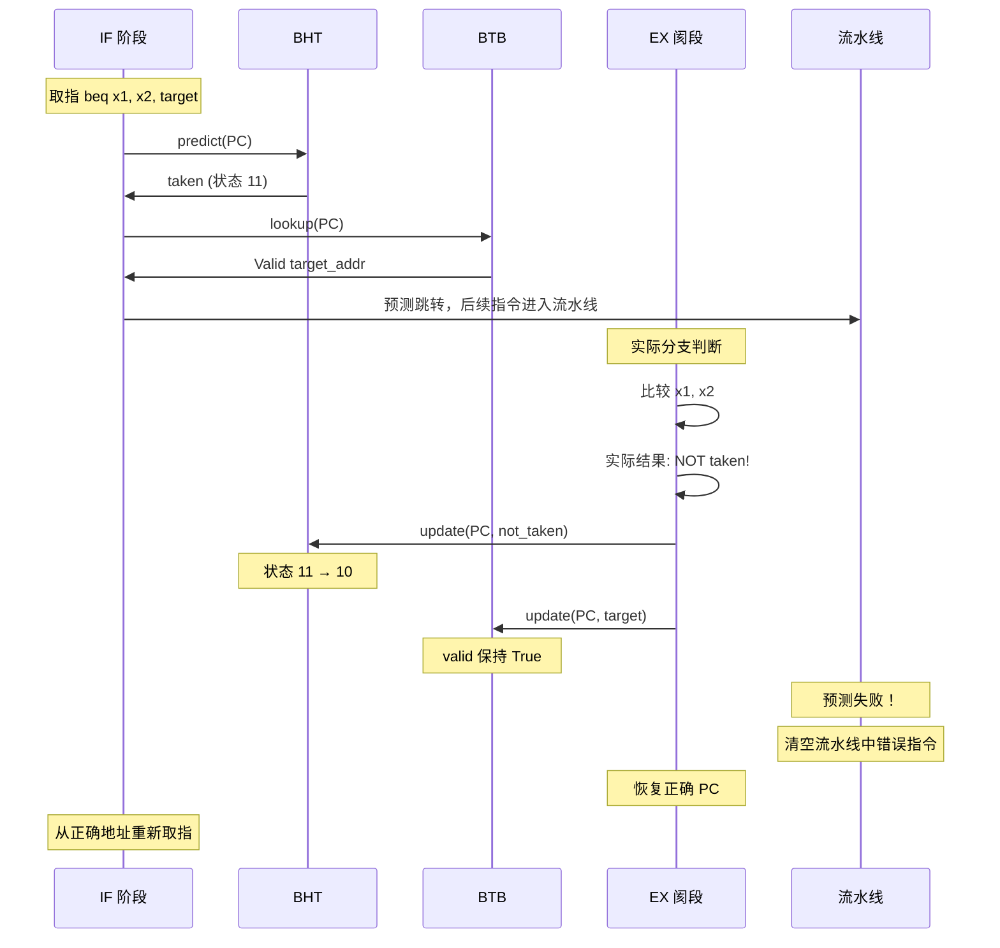
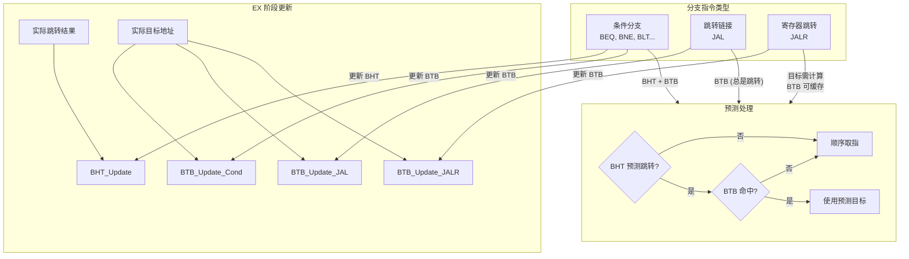

# 分支预测机制图解

本处理器采用动态分支预测技术，包含分支历史表 (BHT) 和分支目标缓冲区 (BTB)。

## 1. 分支预测组件总览



## 2. BHT - 2位饱和计数器



### 预测逻辑

```bsv
// Types.bsv:241-243
function Bool bhtPredict(BHTState state);
    return (state >= 2'b10);  // 10, 11 预测跳转
endfunction
```

| 状态 | 值 | 预测结果 | 置信度 |
|------|-----|----------|--------|
| S00 | 00 | not taken | 高 |
| S01 | 01 | not taken | 低 |
| S10 | 10 | taken | 低 |
| S11 | 11 | taken | 高 |

### 状态更新逻辑

```bsv
// Types.bsv:246-254
function BHTState bhtUpdate(BHTState state, Bool taken);
    case (state)
        2'b00: return taken ? 2'b01 : 2'b00;
        2'b01: return taken ? 2'b10 : 2'b00;
        2'b10: return taken ? 2'b11 : 2'b01;
        2'b11: return taken ? 2'b11 : 2'b10;
        default: return 2'b01;
    endcase
endfunction
```

## 3. BTB - 分支目标缓冲区



### BTB 条目结构

```bsv
// Types.bsv:160-164
typedef struct {
    Addr    branch_pc;      // 分支指令地址（用于匹配）
    Addr    target_addr;    // 分支目标地址
    Bool    valid;          // 条目是否有效
} BTBEntry deriving (Bits, Eq, FShow);
```

## 4. 预测流程时序图



## 5. 预测失败处理



### 预测失败惩罚

| 场景 | 惩罚周期数 | 说明 |
|------|------------|------|
| 预测跳转，实际不跳转 | 2-3 周期 | 清空已取的错误指令 |
| 预测不跳转，实际跳转 | 2-3 周期 | 从目标地址重新取指 |
| BTB 未命中 | 1 周期 | 无法预测目标，等待 EX 计算 |

## 6. 索引方式

```mermaid
flowchart LR
    subgraph PC_Address["PC 地址结构"]
        PC_Bits["PC (32位)"]
        PC_Index["PC bits 11-2<br/>10位索引"]
        PC_Tag["PC bits 31-12<br/>20位标签<br/>(未使用)"]
    end

    PC_Bits --> PC_Index
    PC_Bits --> PC_Tag

    PC_Index -->|"直接映射"| BHT_Entries["BHT 64 条目"]
    PC_Index -->|"直接映射"| BTB_Entries["BTB 64 条目"]

    note right of BHT_Entries
        简单直接映射
        可能存在冲突
        适用于小规模设计
    end note
```

**设计说明**：
- 使用 PC 的低 10 位作为索引（64 条目 × 4 字节/条目 = 256 字节对齐）
- 未使用标签比较，可能导致别名冲突
- 对于嵌入式处理器规模，简单方案足够

## 7. 分支类型处理



## 8. 预测准确率优化

```mermaid
flowchart TB
    subgraph Factors["影响准确率因素"]
        HistoryBits["历史位数<br/>当前: 2位"]
        Entries["条目数<br/>当前: 64"]
        Associativity["关联性<br/>当前: 直接映射"]
    end

    subgraph Improvements["优化方向"]
        MoreBits["增加历史位数<br/>→ 更精细预测"]
        MoreEntries["增加条目数<br/>→ 减少冲突"]
        SetAssoc["组关联<br/>→ 减少别名"]
        GlobalHistory["全局历史<br/>→ 相关性预测"]
    end

    Factors --> Improvements

    note right of Improvements
        当前设计适合嵌入式处理器
        准确率约 85-90%
        进一步优化会增加硬件复杂度
    end note
```

## 9. 代码实现

### IF 阶段预测查询

```bsv
// Core.bsv:75-103
rule fetchStage (programLoaded && state == RUNNING && !stall_load_use && !branch_flush);
    Addr fetchPC = pcReg;
    Bool take_prediction = False;
    Addr prediction_target = 0;

    Maybe#(Addr) btb_hit = btb.lookup(fetchPC);
    Bool bht_predict = bht.predict(fetchPC);

    if (btb_hit matches tagged Valid .target &&& bht_predict) begin
        take_prediction = True;
        prediction_target = target;
        fetchPC = target;
    end
    // ...
endrule
```

### EX 阶段更新

```bsv
// Core.bsv:251-268
// 更新BHT和BTB
Bool btb_update_valid = (pkt.is_jump) || (pkt.is_branch && branch_taken);
btb.update(pkt.pc, actual_target, btb_update_valid);
if (pkt.is_branch)
    bht.update(pkt.pc, branch_taken);

// 分支/跳转执行
if (branch_taken) begin
    pcReg <= actual_target;
    branch_flush <= True;
    no_pc_update <= True;
    if2id.clear;
    id2ex.clear;
end
```

**更新策略**：
- JAL/JALR：总是跳转，更新 BTB
- 条件分支：仅在实际跳转时更新 BTB
- BHT 仅对条件分支更新（JAL 不需要历史预测）

**分支冲刷**：
- 分支跳转时设置 `branch_flush` 和 `no_pc_update` 标志
- 阻止 IF 阶段在跳转后继续取指