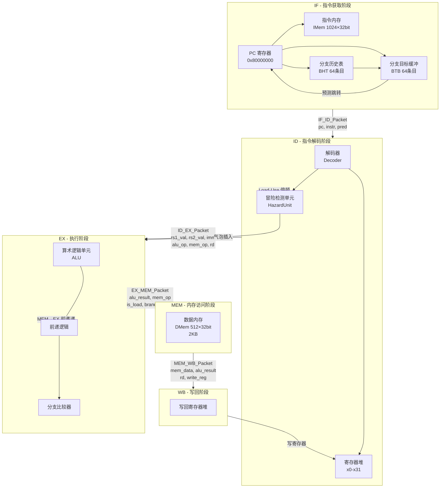
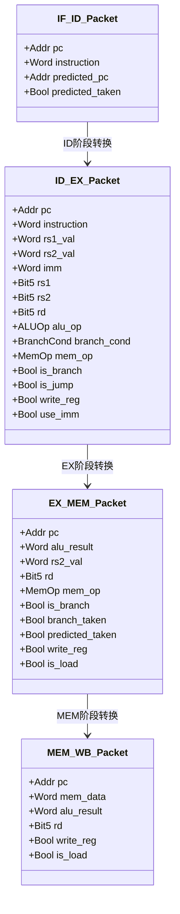
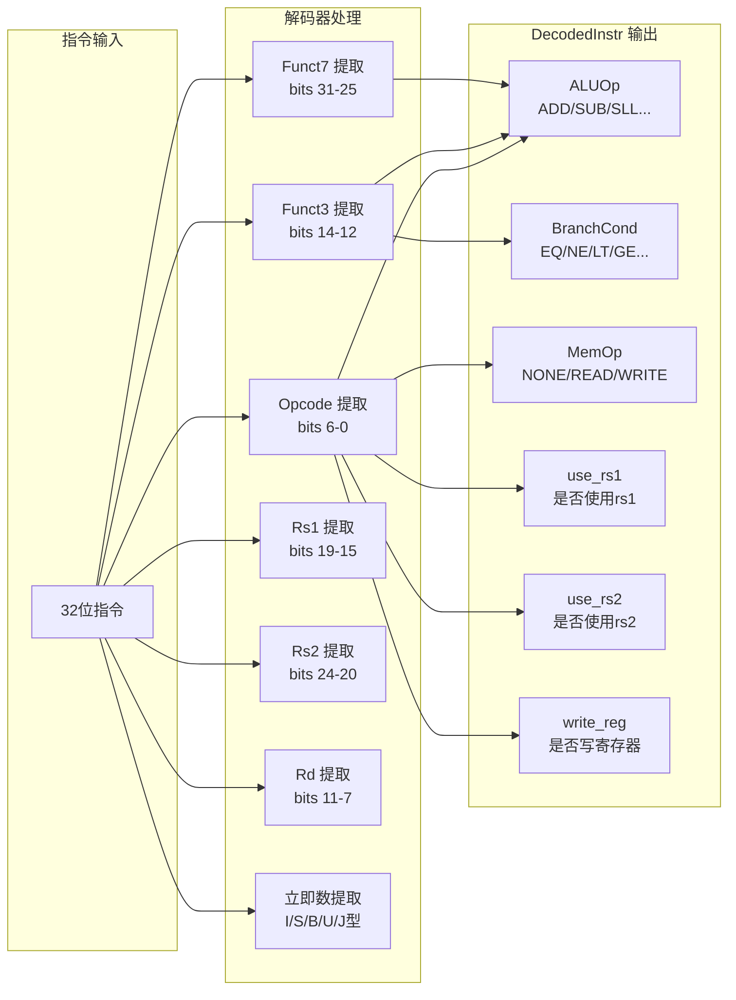

# RISC-V 五级流水线架构图解

本文档使用 Mermaid 图表展示 RISC-V 处理器的设计架构和数据流。

## 1. 五级流水线整体架构

## 2. 流水线寄存器数据包结构

## 3. 指令类型与解码结果

### 指令类型对照表

| Opcode | 类型 | use_rs1 | use_rs2 | 说明 |
|--------|------|---------|---------|------|
| 0110011 | R-Type | ✓ | ✓ | ADD, SUB, AND, OR... |
| 0010011 | I-Type | ✓ | ✗ | ADDI, ANDI, SLLI... |
| 0000011 | Load | ✓ | ✗ | LB, LH, LW, LBU, LHU |
| 0100011 | Store | ✓ | ✓ | SB, SH, SW |
| 1100011 | Branch | ✓ | ✓ | BEQ, BNE, BLT, BGE... |
| 0110111 | LUI | ✗ | ✗ | LUI (加载高位立即数) |
| 0010111 | AUIPC | ✗ | ✗ | AUIPC |
| 1101111 | JAL | ✗ | ✗ | JAL (跳转并链接) |
| 1100111 | JALR | ✓ | ✗ | JALR (寄存器跳转) |