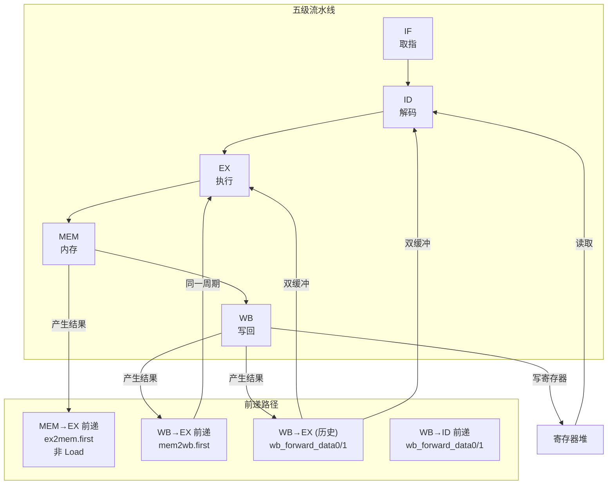
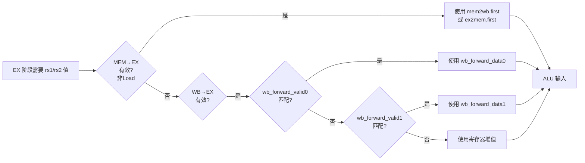
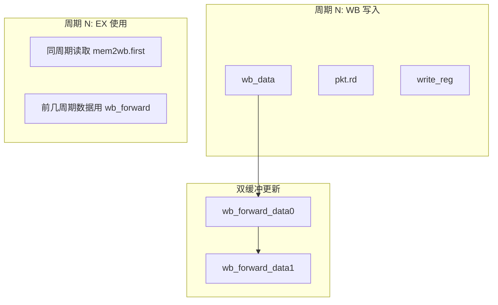
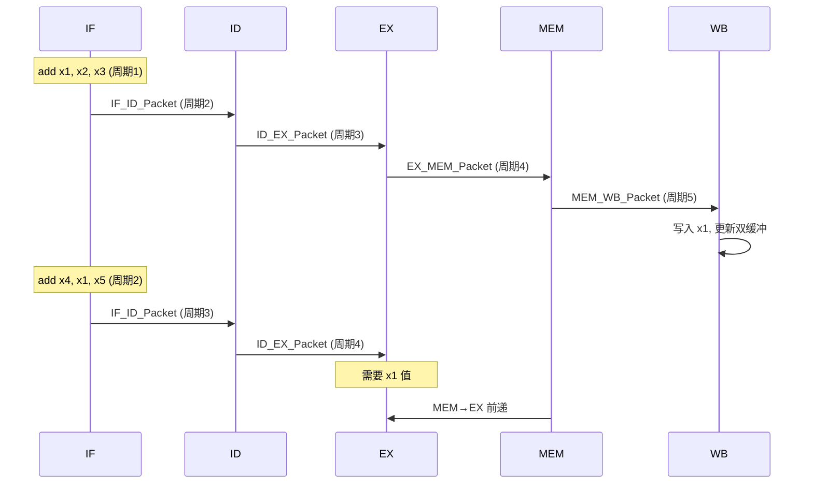
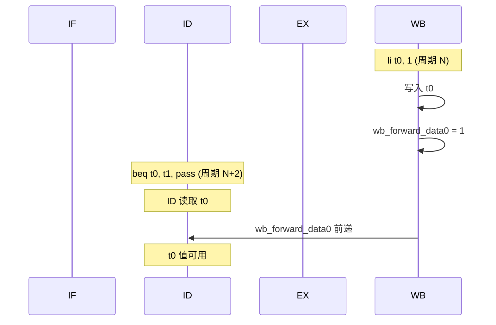

# 数据前递机制图解

数据前递（Data Forwarding）是解决数据冒险的关键技术，允许后续指令在数据写入寄存器堆之前就获取到结果。

## 1. 前递路径总览



## 2. 前递优先级

当多个前递源同时有效时，按以下优先级选择：



**优先级规则**：
1. **MEM→EX 最高** - 从 ex2mem.first 读取，非 Load 数据同周期可用
2. **WB→EX 中** - 从 mem2wb.first 读取，Load 数据在 WB 阶段可用
3. **WB→EX (历史) 次低** - wb_forward_data0/1 双缓冲，解决 mkReg 写入延迟
4. **WB→ID 最低** - 分支指令读取寄存器时使用
5. **寄存器堆默认** - 无前递时使用

## 3. 双缓冲机制

WB 前递使用双缓冲解决 mkReg 写入延迟问题：



**时序**：
- `wb_forward_data0` 保存上一周期 WB 写入
- `wb_forward_data1` 保存两周期前 WB 写入
- 双缓冲确保同一周期内可同时写入和读取

## 4. 前递时序图

### 正常前递场景（ADD → ADD）



### WB→ID 前递场景（分支）



## 5. 代码实现要点

```bsv
// EX 阶段前递逻辑 (Core.bsv:183-220)
Word op1 = pkt.rs1_val;  // 默认使用 ID 阶段读取的值

// WB→EX 前递（直接读取 mem2wb.first，同周期可用）
if (mem2wb.notEmpty && mem2wb.first.write_reg && mem2wb.first.rd == pkt.rs1 && pkt.rs1 != 0)
    op1 = mem2wb.first.is_load ? mem2wb.first.mem_data : mem2wb.first.alu_result;
else if (wb_forward_valid0 && wb_forward_rd0 == pkt.rs1 && pkt.rs1 != 0)
    op1 = wb_forward_data0;
else if (wb_forward_valid1 && wb_forward_rd1 == pkt.rs1 && pkt.rs1 != 0)
    op1 = wb_forward_data1;

// MEM→EX 前递（从 ex2mem FIFO 读取上一周期 EX 输出）
if (ex2mem.notEmpty && ex2mem.first.write_reg && !ex2mem.first.is_load && ex2mem.first.rd == pkt.rs1 && pkt.rs1 != 0)
    op1 = ex2mem.first.alu_result;
```

```bsv
// WB 阶段双缓冲更新 (Core.bsv:417-425)
wb_forward_data1 <= wb_forward_data0;
wb_forward_rd1 <= wb_forward_rd0;
wb_forward_valid1 <= wb_forward_valid0;

wb_forward_data0 <= wb_data;
wb_forward_rd0 <= pkt.rd;
wb_forward_valid0 <= pkt.write_reg;
```

**关键点**：
- `x0` 寄存器永远为 0，不参与前递
- Load 指令数据在 MEM 阶段不可用，MEM→EX 前递排除 Load
- Load 数据在 WB 阶段通过 mem2wb.first 或 wb_forward_data0 前递
- 双缓冲确保前递数据在多个周期内可用