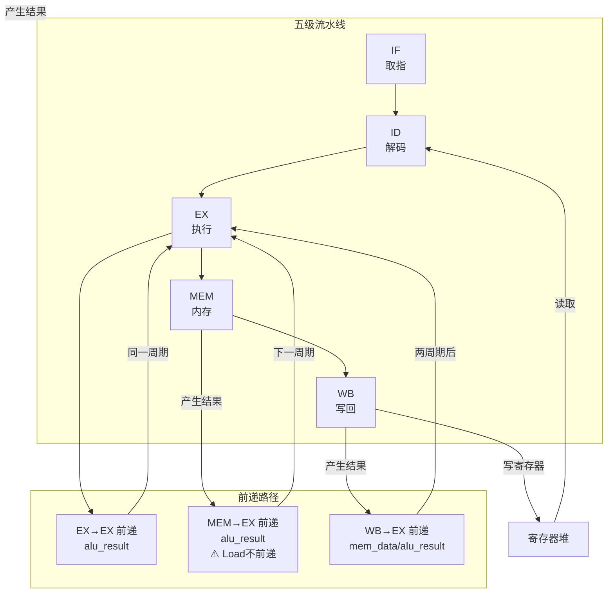
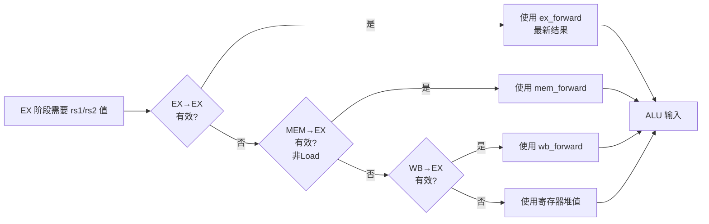
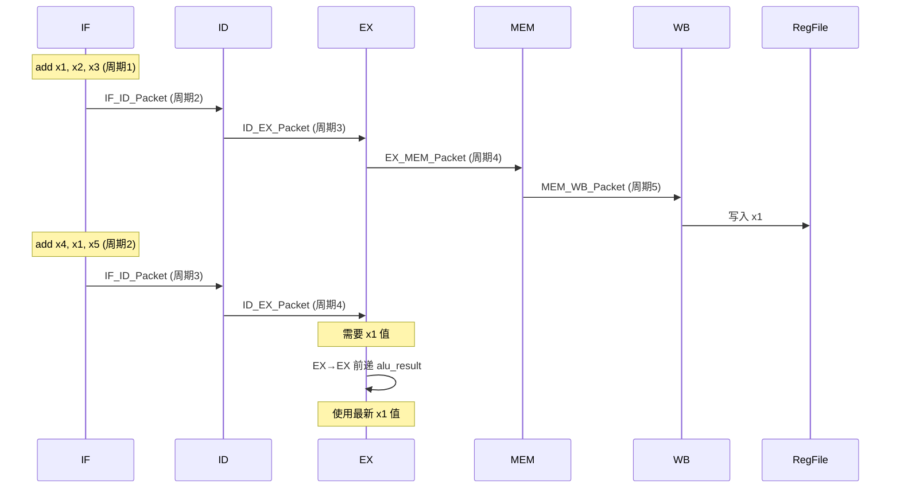
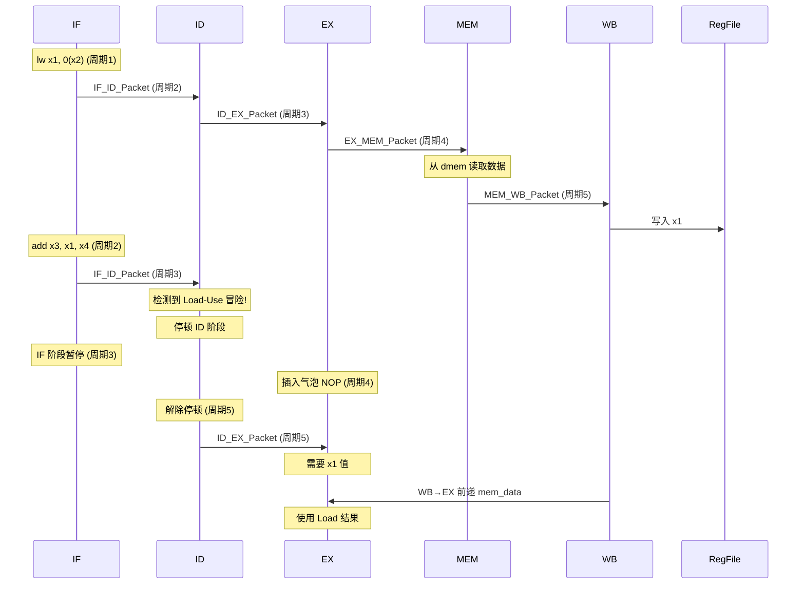
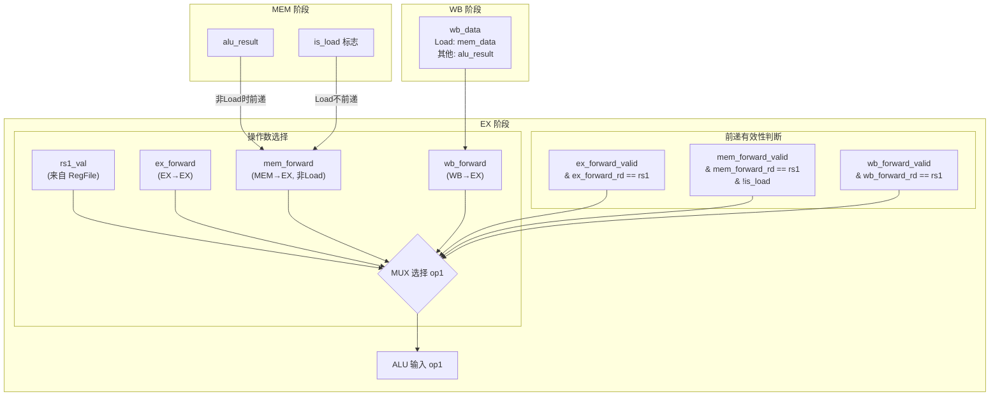

# 数据前递机制图解

数据前递（Data Forwarding）是解决数据冒险的关键技术，允许后续指令在数据写入寄存器堆之前就获取到结果。

## 1. 前递路径总览



## 2. 前递优先级

当多个前递源同时有效时，按以下优先级选择：



**优先级规则**：
1. **EX→EX 最高** - 刚产生的结果，最新
2. **MEM→EX 次高** - 但 Load 指令不在此前递（数据尚未从内存读取）
3. **WB→EX 第三** - Load 数据在此阶段可用
4. **寄存器堆最低** - 默认来源

## 3. 前递时序图

### 正常前递场景（ADD → ADD）



### Load-Use 场景（LW → ADD）



## 4. 前递数据流详细图



## 5. 前递控制信号

| 信号 | 来源 | 有效条件 | 数据内容 |
|------|------|----------|----------|
| `ex_forward` | EX 阶段 | `write_reg && rd != 0` | `alu_result` |
| `mem_forward` | MEM 阶段 | `write_reg && !is_load` | `alu_result` |
| `wb_forward` | WB 阶段 | `write_reg` | `mem_data` (Load) 或 `alu_result` |
| `ex_forward_rd` | EX 阶段 | - | 目标寄存器号 |
| `mem_forward_rd` | MEM 阶段 | - | 目标寄存器号 |
| `wb_forward_rd` | WB 阶段 | - | 目标寄存器号 |

## 6. 代码实现要点

```bsv
// EX 阶段前递逻辑 (Core.bsv:179-195)
Word op1 = pkt.rs1_val;  // 默认使用寄存器堆值

// EX→EX 前递 (最高优先级)
if (ex_forward_valid && ex_forward_rd == pkt.rs1 && pkt.rs1 != 0)
    op1 = ex_forward;

// MEM→EX 前递 (次高优先级，Load 不前递)
if (mem_forward_valid && mem_forward_rd == pkt.rs1 && pkt.rs1 != 0 && !ex2mem.first.is_load)
    op1 = mem_forward;

// WB→EX 前递 (最低优先级)
if (wb_forward_valid && wb_forward_rd == pkt.rs1 && pkt.rs1 != 0)
    op1 = wb_forward;
```

**关键点**：
- `x0` 寄存器永远为 0，不参与前递
- Load 指令在 MEM 阶段数据尚未可用，不在 MEM→EX 前递
- Load 数据在 WB 阶段通过 WB→EX 前递传递