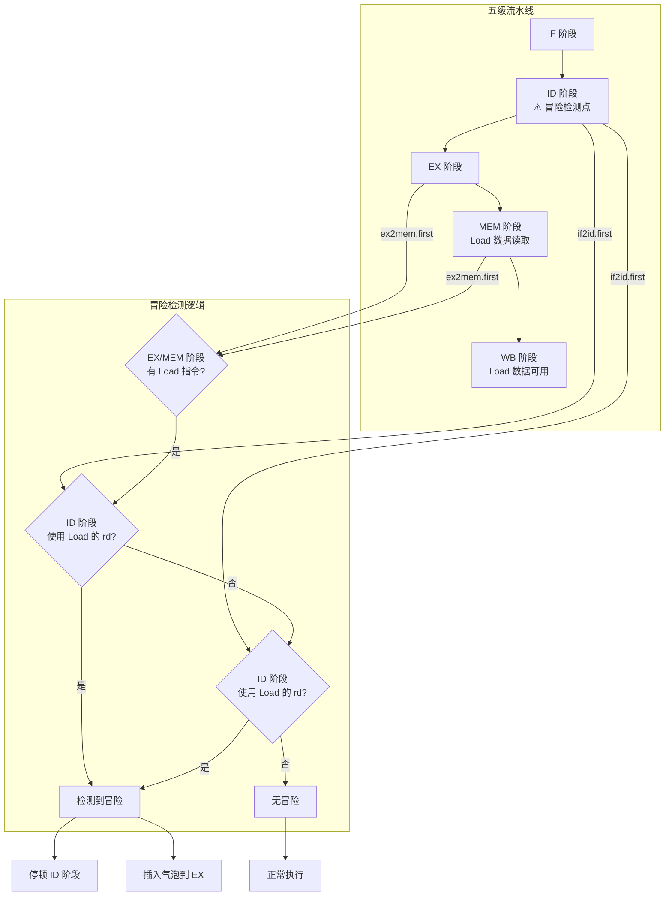
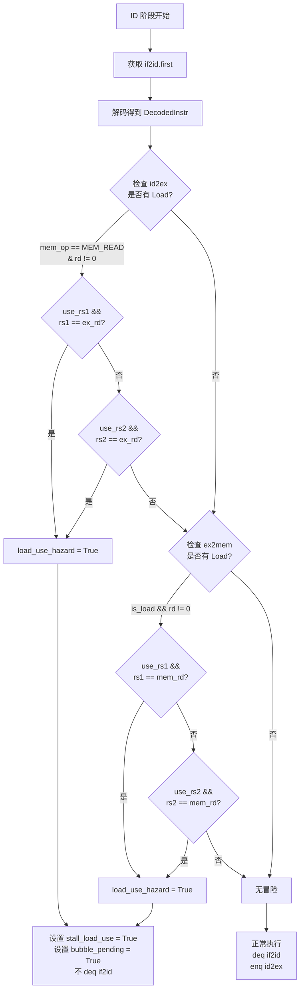
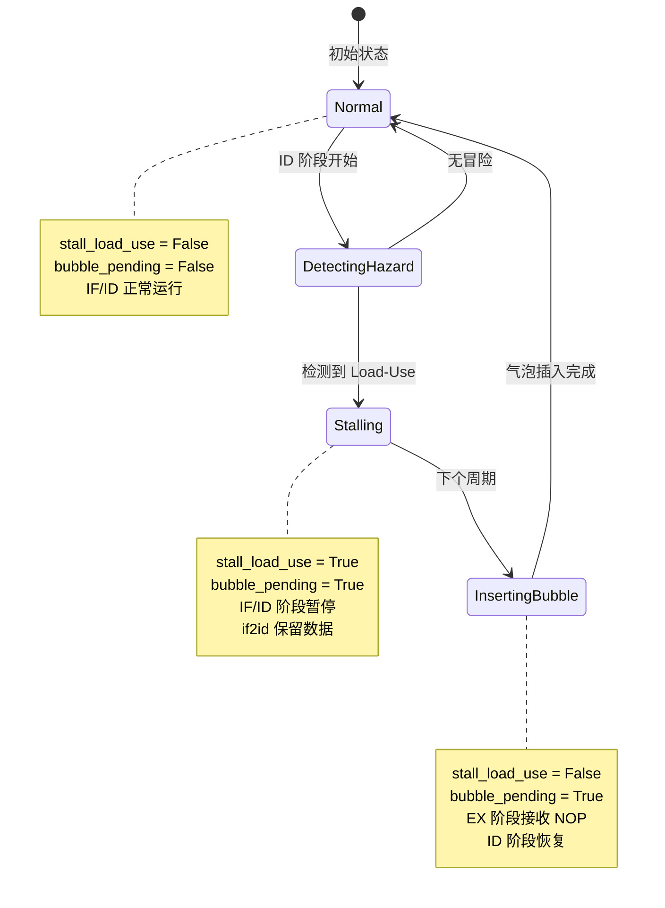
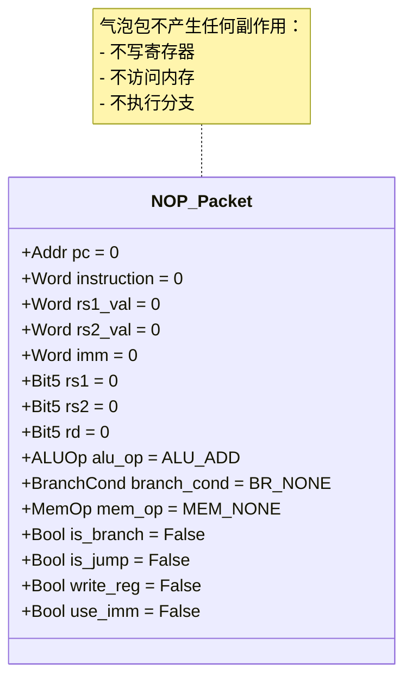
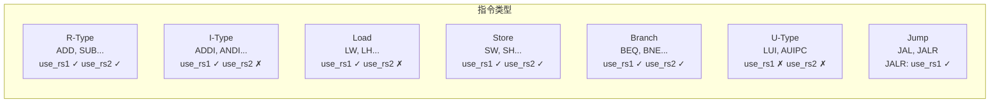
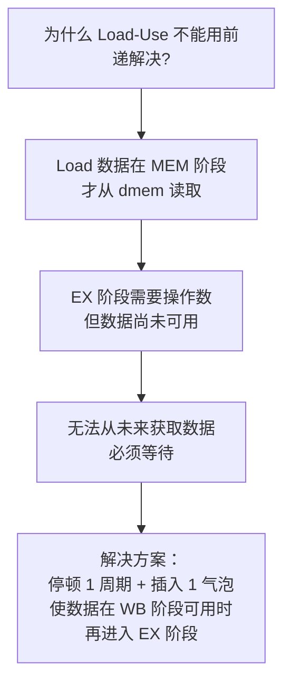

# Load-Use 冒险检测图解

Load-Use 冒险是指 Load 指令后紧跟使用其结果的指令，由于 Load 数据在 MEM 阶段才从内存读取，无法通过正常前递解决，需要流水线停顿。

## 1. 冒险检测位置



## 2. 冒险检测详细逻辑



## 3. 停顿与气泡插入时序

```mermaid
gantt
    title Load-Use 冒险处理时序
    dateFormat X
    axisFormat 周期%s

    section lw x1, 0(x2)
    IF          :1, 1
    ID          :2, 2
    EX          :3, 3
    MEM         :4, 4
    WB          :5, 5

    section add x3, x1, x4
    IF          :2, 2
    ID (检测冒险) :3, 3
    ID (停顿)    :crit, 4, 4
    EX (气泡)   :crit, 5, 5
    EX          :6, 6

    section sub x5, x1, x6
    IF (暂停)   :crit, 3, 3
    IF (暂停)   :crit, 4, 4
    IF          :5, 5
    ID          :6, 6
```



**关键时间点**：
- 周期 3：`add` 在 ID 阶段检测到冒险，停顿
- 周期 4：ID 阶段继续停顿，等待 Load 数据
- 周期 5：Load 在 WB 写回数据，WB→EX 前递可用
- 周期 6：`add` 进入 EX 阶段，使用前递数据

## 4. 控制信号状态转换



## 5. 气泡包内容



## 6. 检测条件详解

### use_rs1 / use_rs2 字段含义



### 冒险检测示例

```asm
# 场景1: Load 后紧跟使用 rs1
lw x1, 0(x2)       # Load 到 x1
add x3, x1, x4     # 使用 x1 作为 rs1 → Load-Use 冒险!
                    # use_rs1=True, rs1=1, ex_rd=1 → 匹配

# 场景2: Load 后紧跟使用 rs2
lw x1, 0(x2)
add x3, x4, x1     # 使用 x1 作为 rs2 → Load-Use 冒险!
                    # use_rs2=True, rs2=1, ex_rd=1 → 匹配

# 场景3: Load 后紧跟不依赖的指令
lw x1, 0(x2)
add x3, x4, x5     # 不使用 x1 → 无冒险
                    # rs1=4, rs2=5, ex_rd=1 → 不匹配

# 场景4: Load x0 (特殊情况)
lw x0, 0(x2)       # Load 到 x0 (永远为0)
add x3, x0, x4     # 使用 x0 → 无冒险 (x0 不参与检测)
                    # ex_rd=0 → 不检测
```

## 7. 实现代码对照

```bsv
// Core.bsv 冒险检测逻辑 (行 104-123)
Bool load_use_hazard = False;

// 检查 EX 阶段 (id2ex) - Load 指令刚从 EX 进入 MEM
if (id2ex.notEmpty && id2ex.first.mem_op == MEM_READ && id2ex.first.rd != 0) begin
    if (dec.use_rs1 && dec.rs1 == id2ex.first.rd)
        load_use_hazard = True;
    if (dec.use_rs2 && dec.rs2 == id2ex.first.rd)
        load_use_hazard = True;
end

// 检查 MEM 阶段 (ex2mem) - Load 指令在 MEM 执行内存读取
if (ex2mem.notEmpty && ex2mem.first.is_load && ex2mem.first.rd != 0 && !load_use_hazard) begin
    if (dec.use_rs1 && dec.rs1 == ex2mem.first.rd)
        load_use_hazard = True;
    if (dec.use_rs2 && dec.rs2 == ex2mem.first.rd)
        load_use_hazard = True;
end

// 冒险处理 (行 125-151)
if (load_use_hazard) begin
    stall_load_use <= True;     // 停顿 ID 阶段
    bubble_pending <= True;     // 标记需要插入气泡
    // 不 deq if2id，保留指令供下个周期使用
end else begin
    // 正常解码并发送到 EX
    if2id.deq;
    id2ex.enq(packet);
end
```

## 8. 为什么需要停顿？



**与其他冒险的区别**：
- **RAW (非 Load)**：可通过前递解决，无需停顿
- **Load-Use RAW**：数据在 MEM 阶段才产生，必须停顿
- **结构冒险**：硬件资源冲突，需要停顿
- **控制冒险**：分支预测失败，需要清空流水线