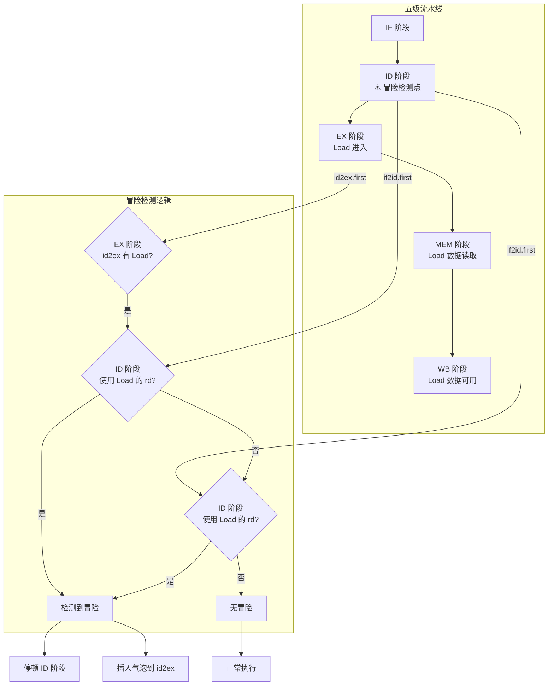
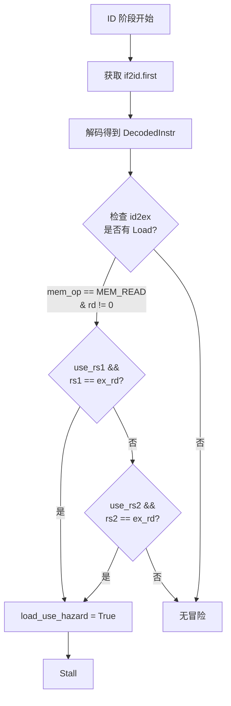
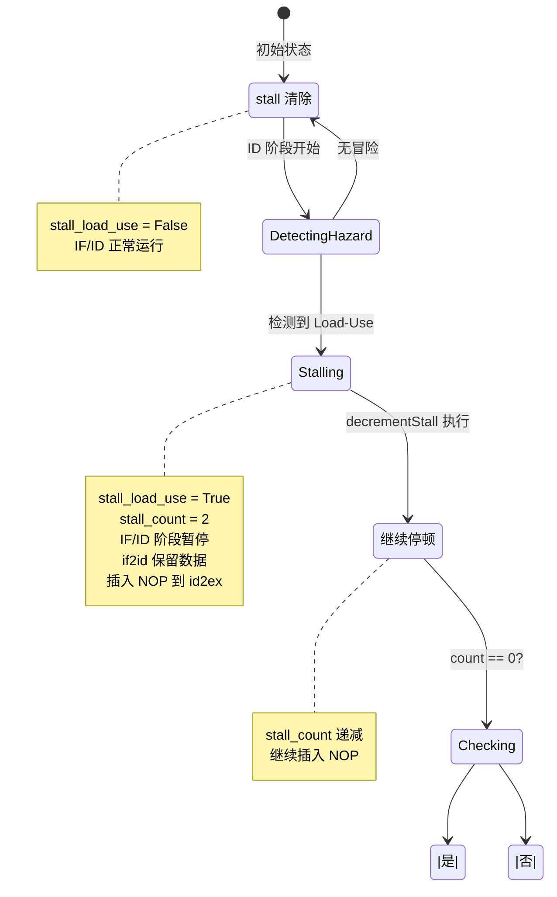
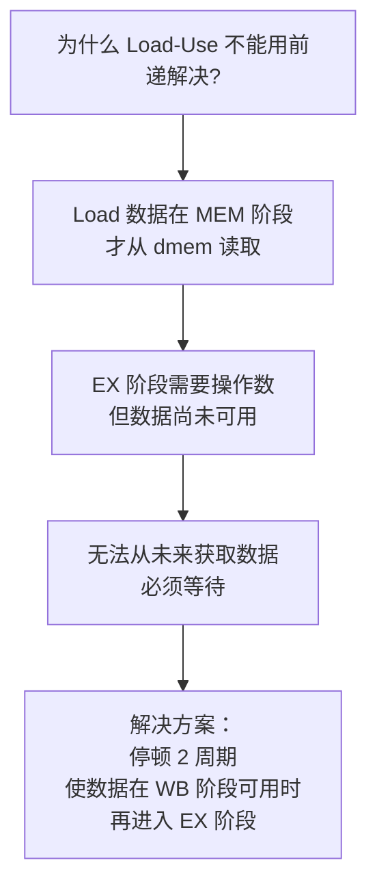

# Load-Use 冒险检测图解

Load-Use 冒险是指 Load 指令后紧跟使用其结果的指令，由于 Load 数据在 MEM 阶段才从内存读取，无法通过正常前递解决，需要流水线停顿。

## 1. 冒险检测位置



**注意**：当前实现只检查 EX 阶段 (id2ex) 的 Load，因为 Load 在 EX 阶段刚进入流水线时就需要检测。

## 2. 冒险检测详细逻辑



## 3. 停顿与气泡插入时序

```mermaid
gantt
    title Load-Use 冒险处理时序
    dateFormat X
    axisFormat 周期%s

    section lw x1, 0(x2)
    IF          :1, 1
    ID          :2, 2
    EX          :3, 3
    MEM         :4, 4
    WB          :5, 5

    section add x3, x1, x4
    IF          :2, 2
    ID (检测冒险) :3, 3
    ID (停顿)    :crit, 4, 4
    ID (停顿)    :crit, 5, 5
    EX          :6, 6

    section decrementStall
    count=2    :crit, 3, 3
    count=1    :crit, 4, 4
    count=0    :5, 5
```



**关键时间点**：
- 周期 3：`add` 在 ID 阶段检测到冒险，设置 `stall_load_use = True`，`stall_count = 2`
- 周期 4：ID 阶段停顿，decrementStall 执行，`count = 1`，插入 NOP
- 周期 5：ID 阶段继续停顿，decrementStall 执行，`count = 0`，`stall_load_use = False`
- 周期 6：`add` 进入 EX 阶段，Load 数据通过 WB→EX 前递可用

## 4. 控制信号



## 5. 气泡包内容

```bsv
function ID_EX_Packet nopPacket();
    return ID_EX_Packet {
        pc: 0,
        instruction: 0,
        rs1_val: 0, rs2_val: 0,
        imm: 0,
        rs1: 0, rs2: 0, rd: 0,
        alu_op: ALU_ADD,
        branch_cond: BR_NONE,
        mem_op: MEM_NONE,
        is_branch: False,
        is_jump: False,
        write_reg: False,
        use_imm: False,
        mem_width: MEM_WORD,
        mem_unsigned: False
    };
endfunction
```

**气泡包不产生任何副作用**：
- 不写寄存器
- 不访问内存
- 不执行分支

## 6. 实现代码对照

```bsv
// Core.bsv 冒险检测逻辑 (行 112-127)
Bool load_use_hazard = False;

// 检查 EX 阶段 (id2ex) - Load 指令刚从 EX 进入 MEM
if (id2ex.notEmpty && id2ex.first.mem_op == MEM_READ && id2ex.first.rd != 0) begin
    if (dec.use_rs1 && dec.rs1 == id2ex.first.rd)
        load_use_hazard = True;
    if (dec.use_rs2 && dec.rs2 == id2ex.first.rd)
        load_use_hazard = True;
end

if (load_use_hazard) begin
    stall_load_use <= True;
    stall_count <= 2;  // Load 需要 2 周期从 EX→MEM→WB
    id2ex.enq(nopPacket());  // 立即插入气泡
end else begin
    if2id.deq;
    // 正常发送到 EX...
end
```

```bsv
// Core.bsv stall 计数递减 (行 166-174)
rule decrementStall (stall_load_use && stall_count > 0);
    Bit#(2) new_count = stall_count - 1;
    stall_count <= new_count;
    if (new_count == 0) begin
        stall_load_use <= False;
    end
    id2ex.enq(nopPacket());
endrule
```

## 7. 为什么需要停顿？



**与其他冒险的区别**：
- **RAW (非 Load)**：可通过前递解决，无需停顿
- **Load-Use RAW**：数据在 MEM 阶段才产生，必须停顿
- **结构冒险**：硬件资源冲突，需要停顿
- **控制冒险**：分支预测失败，需要清空流水线