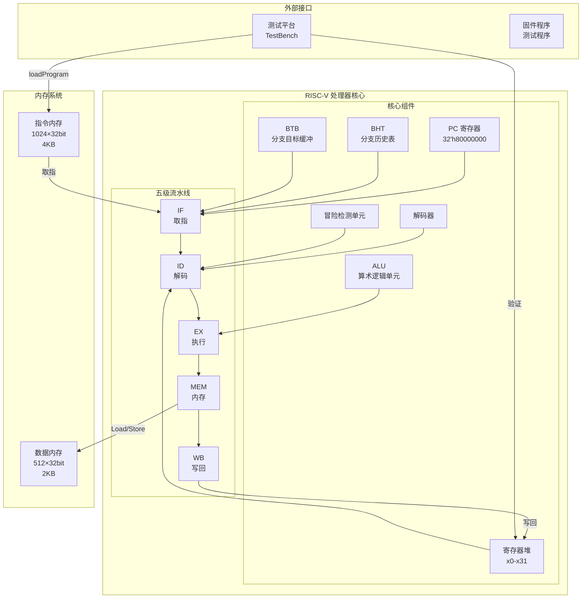
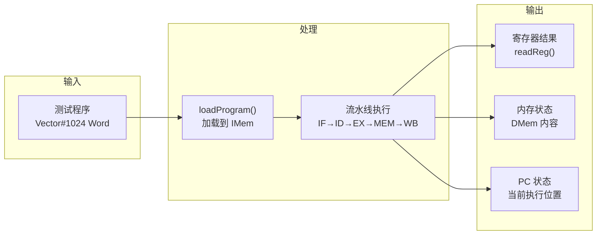
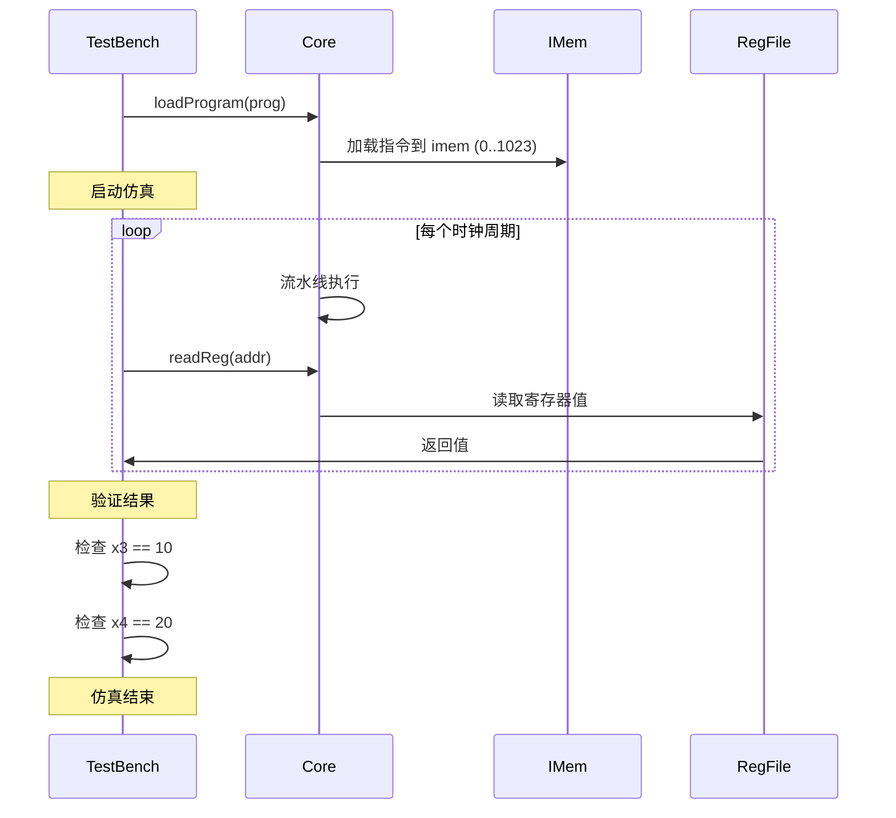
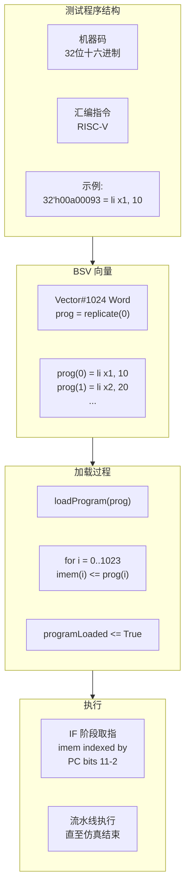
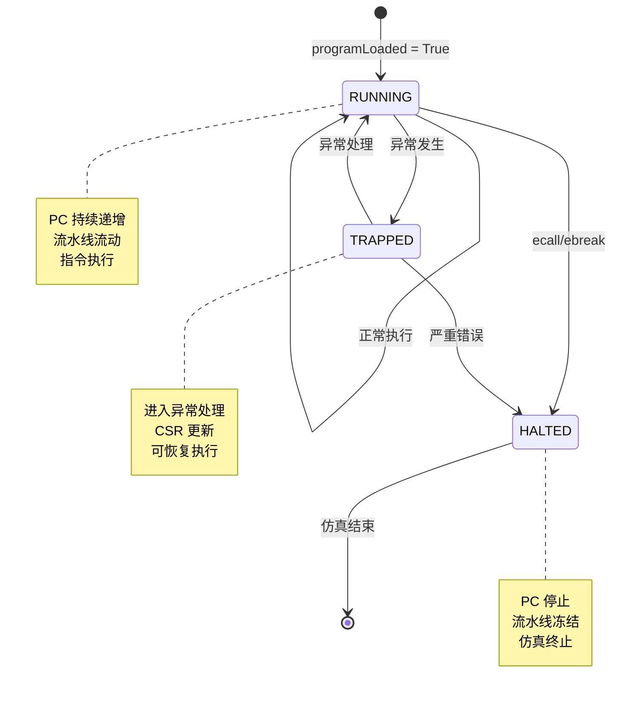
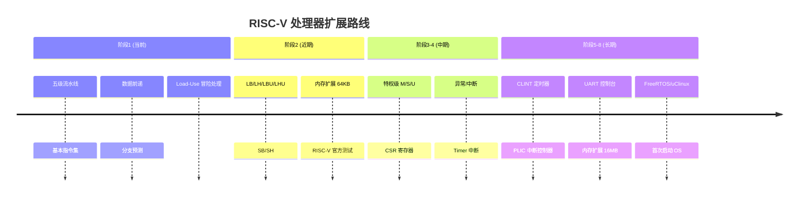

# 内存布局与整体架构图解

本文档描述 RISC-V 处理器的内存布局、地址空间分配和整体架构。

## 1. 整体架构图



## 2. 内存地址空间布局

```mermaid
flowchart TB
    subgraph AddressSpace["32位地址空间"]
        Base["基地址<br/>0x80000000"]

        subgraph IMemRange["指令内存区域"]
            IMemStart["0x80000000<br/>IMem entry 0"]
            IMemEnd["0x80000FFF<br/>IMem entry 1023"]
            IMemSize["4KB<br/>1024条指令"]
        end

        IMemStart -->|"地址范围"| IMemEnd
        IMemStart -->|"PC"| IMemSize

        subgraph DMemRange["数据内存区域"]
            DMemStart["实际映射<br/>addr bits 10-2 索引"]
            DMemEnd["最大地址<br/>< 2048"]
            DMemSize["2KB<br/>512字"]
        end

        DMemStart --> DMemEnd
        DMemStart --> DMemSize
    end

    note right of AddressSpace
        哈佛架构：
        - IMem 和 DMem 物理分离
        - 可同时访问
        - 无结构冒险
    end note
```

### 地址映射详解

```mermaid
flowchart LR
    subgraph IMemAccess["指令内存访问"]
        InstrAddr["指令地址<br/>32位 Addr"]
        Index1["索引计算<br/>addr bits 11-2"]
        InstrWord["IMem<br/>32位指令"]
    end

    InstrAddr --> Index1 --> InstrWord

    note right of Index1
        10位索引
        覆盖 4KB 空间
        1024 条指令
    end note

    subgraph DMemAccess["数据内存访问"]
        DataAddr["数据地址<br/>32位 Addr"]
        Index2["索引计算<br/>addr bits 10-2"]
        DataWord["DMem<br/>32位数据"]
    end

    DataAddr --> Index2 --> DataWord

    note right of Index2
        9位索引
        覆盖 2KB 空间
        512 个字
    end note
```

### 地址范围对照

| 内存 | 基地址 | 大小 | 索引位 | 最大索引 |
|------|--------|------|--------|----------|
| IMem | 0x80000000 | 4KB (1024×4) | addr[11:2] (10位) | 1023 |
| DMem | - | 2KB (512×4) | addr[10:2] (9位) | 511 |

**地址限制**：
- IMem: PC 必须 < 0x80001000
- DMem: Load/Store 地址必须 < 2048 (实际 2KB 边界)

## 3. 寄存器堆结构

```mermaid
flowchart TB
    subgraph RegFile32["32个通用寄存器"]
        X0["x0 (零寄存器)<br/>永远为 0"]
        X1["x1 (ra)<br/>返回地址"]
        X2["x2 (sp)<br/>栈指针"]
        X3["x3 (gp)<br/>全局指针"]
        X4["x4 (tp)<br/>线程指针"]
        X5_X7["x5-x7 (t0-t2)<br/>临时寄存器"]
        X8_X9["x8-x9 (s0-s1)<br/>保存寄存器"]
        X10_X17["x10-x17 (a0-a7)<br/>参数/返回值"]
        X18_X27["x18-x27 (s2-s11)<br/>保存寄存器"]
        X28_X31["x28-x31 (t3-t6)<br/>临时寄存器"]
    end

    subgraph AccessPorts["访问端口"]
        Read1["read1(rs1)<br/>读取端口1"]
        Read2["read2(rs2)<br/>读取端口2"]
        Write["write(rd, value)<br/>写入端口"]
    end

    Read1 --> RegFile32
    Read2 --> RegFile32
    Write --> RegFile32

    note right of X0
        RISC-V 约定：
        x0 硬连线为 0
        写入 x0 无效果
        不参与前递/冒险检测
    end note

    note left of AccessPorts
        BSV 实现：
        - 双读取端口
        - 单写入端口
        - 同周期读写
    end note
```

### 寄存器 ABI 命名

| 寄存器 | ABI 名称 | 用途 | 说明 |
|--------|----------|------|------|
| x0 | zero | 常数 0 | 硬连线 |
| x1 | ra | 返回地址 | JAL/JALR 使用 |
| x2 | sp | 栈指针 | 保存 |
| x3 | gp | 全局指针 | 保存 |
| x4 | tp | 纩程指针 | 保存 |
| x5-x7 | t0-t2 | 临时 | 调用者保存 |
| x8-x9 | s0-s1 | 保存 | 被调用者保存 |
| x10-x17 | a0-a7 | 参数/返回 | 调用者保存 |
| x18-x27 | s2-s11 | 保存 | 被调用者保存 |
| x28-x31 | t3-t6 | 临时 | 调用者保存 |

## 4. 模块依赖关系

```mermaid
flowchart TB
    subgraph Packages["BSV 包依赖"]
        Types["Types.bsv<br/>基础类型定义"]

        ALU["ALU.bsv"]
        RegFile["RegFile.bsv"]
        Decoder["Decoder.bsv"]

        BHT["BHT.bsv"]
        BTB["BTB.bsv"]
        HazardUnit["HazardUnit.bsv"]

        Core["Core.bsv<br/>流水线核心"]
        TestBench["TestBench.bsv<br/>测试平台"]
    end

    Types --> ALU
    Types --> RegFile
    Types --> Decoder
    Types --> BHT
    Types --> BTB
    Types --> HazardUnit
    Types --> Core

    ALU --> Core
    RegFile --> Core
    Decoder --> Core
    BHT --> Core
    BTB --> Core
    HazardUnit --> Core

    Core --> TestBench

    note right of Types
        Types 包定义：
        - Word, Addr 类型
        - 流水线数据包结构
        - 枚举类型
        - 辅助函数
    end note
```

## 5. 数据流总览



## 6. 测试平台交互



## 7. 程序加载流程



### 测试程序示例

```bsv
// TestBench.bsv
function Vector#(1024, Word) testProgram();
    Vector#(1024, Word) prog = replicate(0);
    prog[0] = 32'h00a00093;    // li x1, 10
    prog[1] = 32'h01400113;    // li x2, 20
    prog[2] = 32'h02010113;    // li x2, 4  (地址偏移)
    prog[3] = 32'h00112023;    // sw x1, 0(x2)
    prog[4] = 32'h00112183;    // lw x3, 0(x2)
    prog[5] = 32'h003081b3;    // add x3, x1, x3
    // ...
    return prog;
endfunction
```

## 8. 处理器状态



## 9. 扩展路线图



## 10. 目录结构

```
riscv-bsv-processor/
├── src/
│   ├── common/
│   │   └── Types.bsv          # 类型定义
│   ├── core/
│   │   ├── Core.bsv           # 流水线核心
│   │   ├── ALU.bsv            # ALU
│   │   ├── RegFile.bsv        # 寄存器堆
│   │   ├── Decoder.bsv        # 解码器
│   │   └── HazardUnit.bsv     # 冒险检测
│   ├── branch/
│   │   ├── BHT.bsv            # 分支历史表
│   │   └── BTB.bsv            # 分支目标缓冲
│   └── soc/
│       └── TestBench.bsv      # 测试平台
├── build/
│   └── mkTestBench.v          # 生成的 Verilog
├── tests/
│   └── c/
│       └── test_bench.cpp     # Verilator C++ 测试
├── obj_dir/
│   └── VmkTestBench           # Verilator 仿真二进制
├── docs/
│   ├── cpu-pipeline-architecture.md  # 流水线架构图解
│   ├── data-forwarding.md             # 数据前递图解
│   ├── load-use-hazard.md             # Load-Use 冒险图解
│   ├── branch-prediction.md           # 分支预测图解
│   ├── pipeline-scheduling.md         # 流水线调度图解
│   └── memory-layout.md               # 本文档
│   ├── roadmap-embedded-os.md         # OS 支持路线图
│   └── superpowers/
│       └── specs/
│           └── 2026-04-12-load-use-hazard-fix-design.md
├── tools/
│   └── elf_to_bsv.py          # ELF 转换工具 (开发中)
├── Makefile
└── CLAUDE.md                  # 项目说明
```