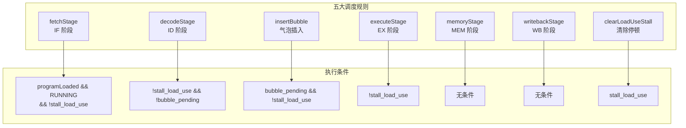
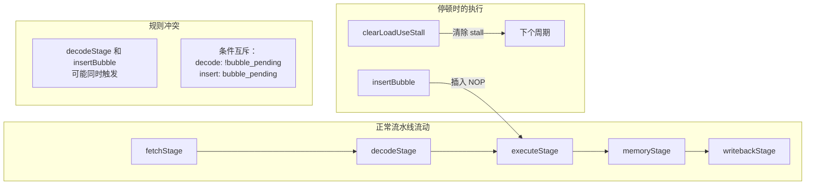
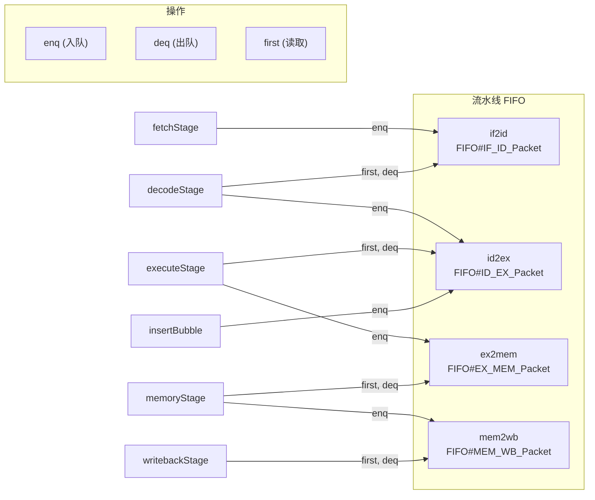
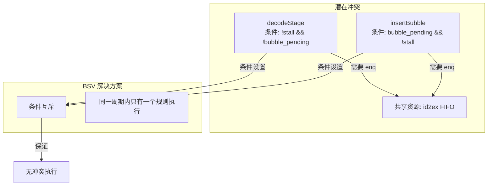
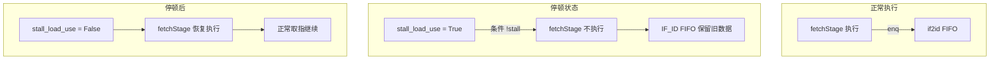
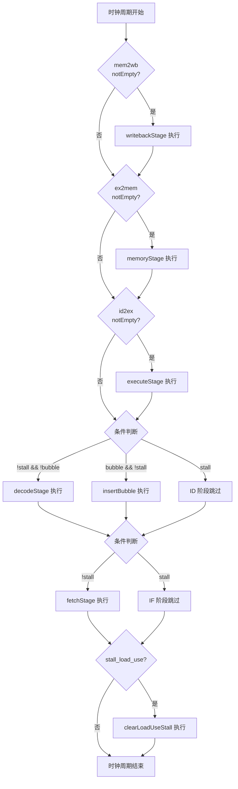
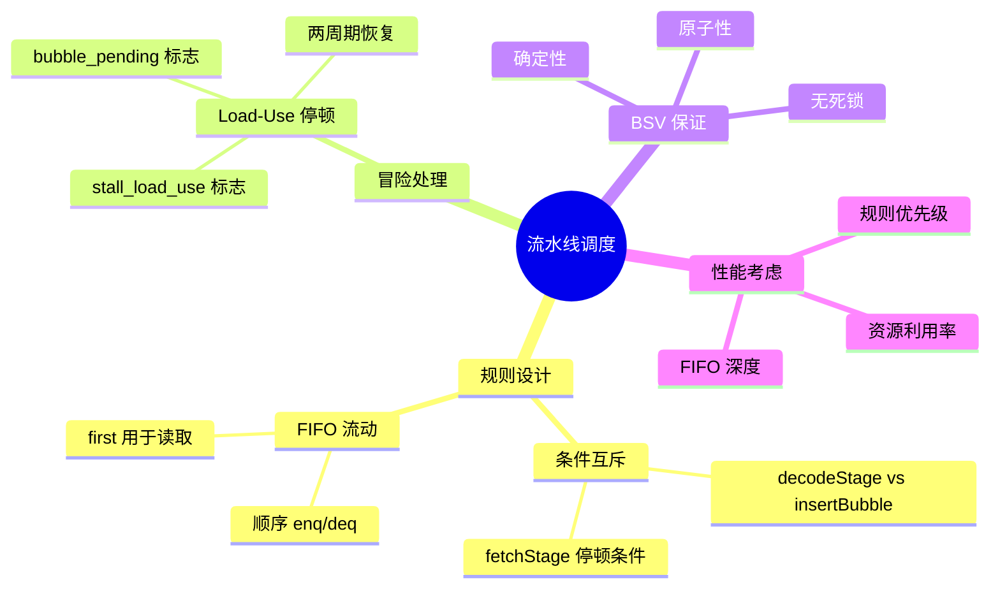

# 流水线调度规则图解

本文档详细说明 BSV 中的流水线调度规则（Rules）及其执行顺序和条件。

## 1. 规则总览



## 2. 规则执行顺序

BSV 编译器会自动分析规则之间的依赖关系并确定执行顺序：



### 规则优先级（由 BSC 编译器确定）

```mermaid
flowchart TB
    Level1["Level 1: 最高优先级"]
    Level2["Level 2: 第二优先级"]
    Level3["Level 3: 第三优先级"]
    Level4["Level 4: 第四优先级"]

    writebackStage --> Level1
    memoryStage --> Level2
    executeStage --> Level3
    decodeStage --> Level4
    insertBubble --> Level4
    fetchStage --> Level4

    note right of Level1
        WB 优先：释放 mem2wb FIFO
        为 MEM 阶段腾出空间
    end note

    note right of Level2
        MEM 优先：释放 ex2mem FIFO
        为 EX 阶段腾出空间
    end note

    note right of Level3
        EX 优先：释放 id2ex FIFO
        为 ID 阶段腾出空间
    end note

    note right of Level4
        IF/ID 最后执行
        insertBubble 与 decodeStage
        条件互斥
    end note
```

## 3. FIFO 流动图



## 4. 冒险处理时序详解

```mermaid
sequenceDiagram
    participant IF as fetchStage
    participant ID as decodeStage
    participant Bubble as insertBubble
    participant EX as executeStage
    participant Clear as clearLoadUseStall
    participant MEM as memoryStage
    participant WB as writebackStage

    Note over IF, ID: 周期 N: 检测到 Load-Use 冒险
    ID->>ID: load_use_hazard = True
    ID->>ID: stall_load_use = True
    ID->>ID: bubble_pending = True
    Note over ID: decodeStage 不执行 (条件 !stall)

    Note over IF: fetchStage 不执行 (条件 !stall)
    Note over EX, MEM, WB: 后续阶段正常执行

    Note over Clear: 周期 N 结束时执行
    Clear->>Clear: stall_load_use = False

    Note over IF, ID: 周期 N+1: 停顿解除
    Note over IF: fetchStage 仍暂停 (刚清除)
    Note over Bubble: insertBubble 执行
    Bubble->>EX: enq NOP 到 id2ex
    Bubble->>Bubble: bubble_pending = False

    Note over ID: decodeStage 可执行
    ID->>ID: 正常解码，enq 到 id2ex

    Note over EX: 周期 N+2
    Note over EX: NOP 在 EX 阶段执行
    Note over EX: 依赖指令进入 EX
```

## 5. 规则冲突与解决

### decodeStage vs insertBubble



**关键设计**：
- `decodeStage` 条件：`!stall_load_use && !bubble_pending`
- `insertBubble` 条件：`bubble_pending && !stall_load_use`
- 两个条件互斥，BSV 编译器能正确调度

### fetchStage 停顿机制



## 6. 完整周期执行流程



## 7. 规则调度矩阵

| 规则 | 执行条件 | 操作的 FIFO | 前置依赖 | 后续影响 |
|------|----------|--------------|----------|----------|
| writebackStage | 无条件 | mem2wb (deq) | memoryStage | 释放 WB→前递 |
| memoryStage | 无条件 | ex2mem (deq), mem2wb (enq) | executeStage | 为 WB 准备数据 |
| executeStage | !stall | id2ex (deq), ex2mem (enq) | decodeStage | 为 MEM 准备数据 |
| decodeStage | !stall && !bubble | if2id (deq), id2ex (enq) | fetchStage | 为 EX 准备数据 |
| insertBubble | bubble && !stall | id2ex (enq) | - | 插入 NOP |
| fetchStage | !stall | if2id (enq) | - | 为 ID 准备数据 |
| clearLoadUseStall | stall | - | - | 清除停顿标志 |

## 8. BSV 调度保证

```mermaid
flowchart TB
    subgraph BSV_Scheduler["BSV 编译器调度"]
        Analysis["规则依赖分析"]
        Ordering["确定执行顺序"]
        Atomic["原子性保证"]
        Conflict["冲突检测"]
    end

    subgraph Guarantees["调度保证"]
        G1["同一周期内<br/>规则按顺序执行"]
        G2["FIFO 操作<br/>不会阻塞"]
        G3["条件互斥<br/>防止冲突"]
        G4["状态更新<br/>在周期结束时生效"]
    end

    Analysis --> Ordering
    Ordering --> G1
    Analysis --> Atomic
    Atomic --> G2
    Analysis --> Conflict
    Conflict --> G3
    Ordering --> G4

    note right of Guarantees
        BSV 的调度器确保：
        1. 无死锁
        2. 无竞争条件
        3. 确定性执行
        4. 高效硬件实现
    end note
```

## 9. 关键代码片段

### fetchStage 规则

```bsv
rule fetchStage (programLoaded && state == RUNNING && !stall_load_use);
    // 条件: 程序已加载、处理器运行、无停顿
    // ...
    if2id.enq(IF_ID_Packet { ... });
    pcReg <= pcReg + 4;
endrule
```

### decodeStage 规则

```bsv
rule decodeStage (!stall_load_use && !bubble_pending);
    // 条件: 无停顿、无待插入气泡
    // 与 insertBubble 条件互斥
    // ...
    if (load_use_hazard) begin
        stall_load_use <= True;
        bubble_pending <= True;
        // 不 deq if2id
    end else begin
        if2id.deq;
        id2ex.enq(ID_EX_Packet { ... });
    end
endrule
```

### insertBubble 规则

```bsv
rule insertBubble (bubble_pending && !stall_load_use);
    // 条件: 有待插入气泡、无停顿
    // 与 decodeStage 条件互斥
    id2ex.enq(nopPacket());
    bubble_pending <= False;
endrule
```

### clearLoadUseStall 规则

```bsv
rule clearLoadUseStall (stall_load_use);
    // 条件: 处于停顿状态
    // 在周期结束时执行，清除标志
    stall_load_use <= False;
endrule
```

## 10. 设计要点总结

