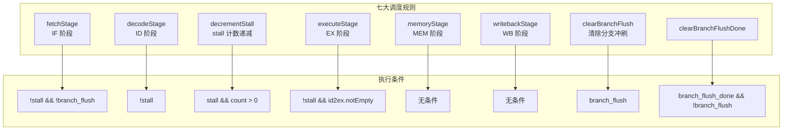
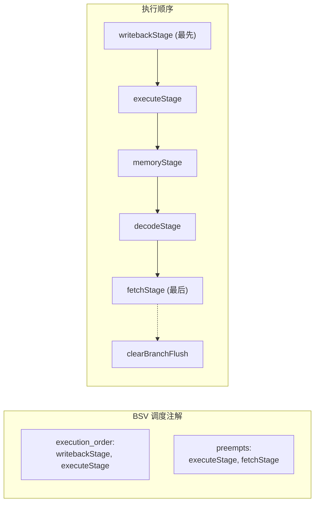
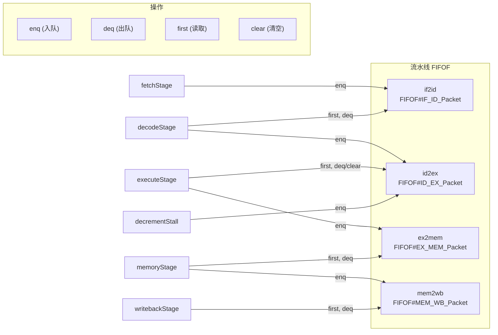
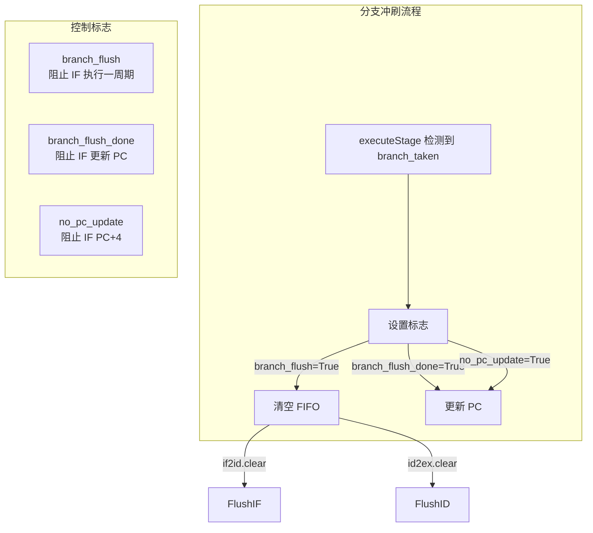
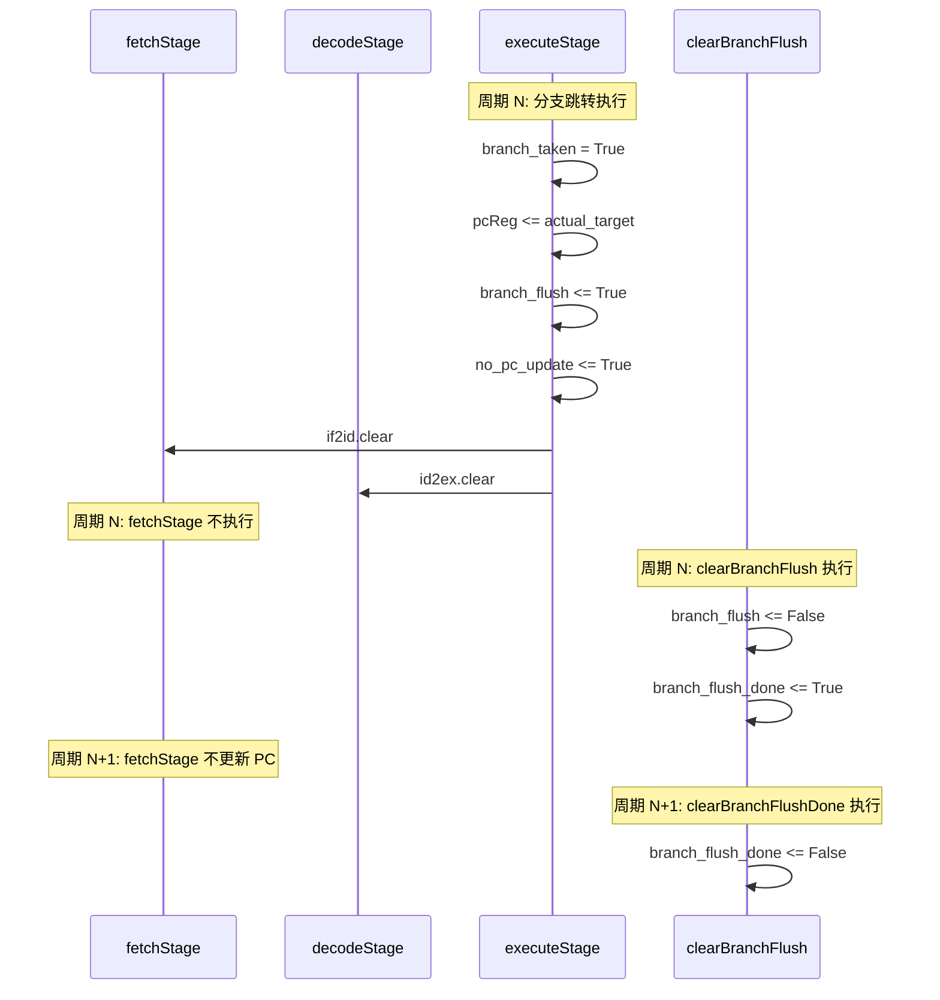
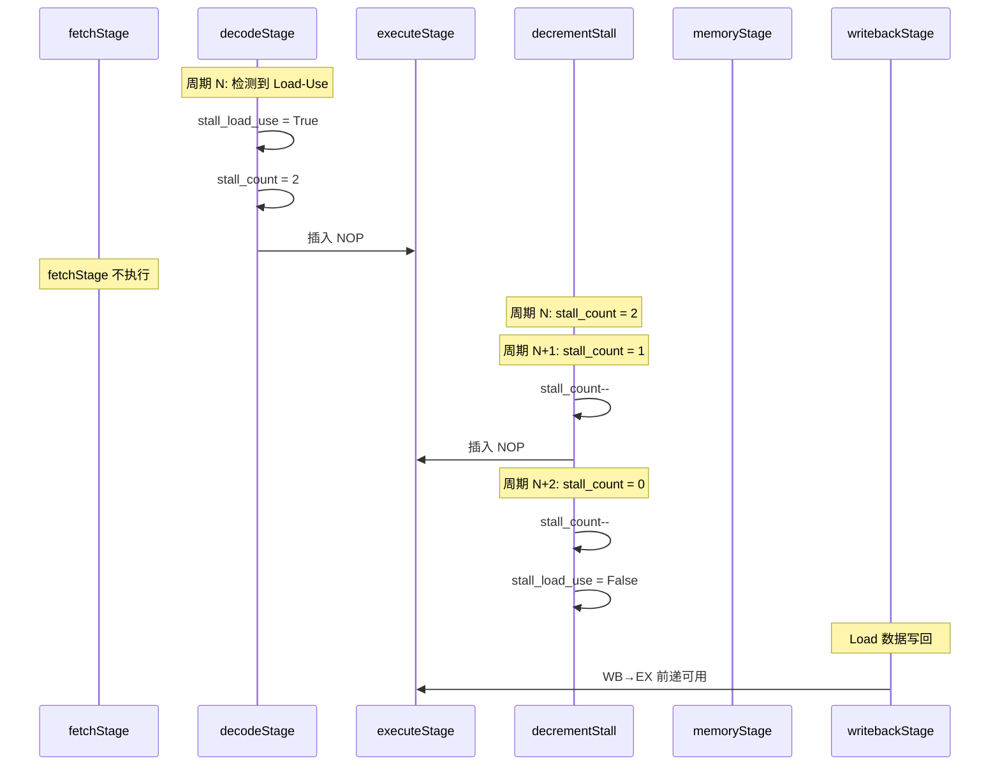
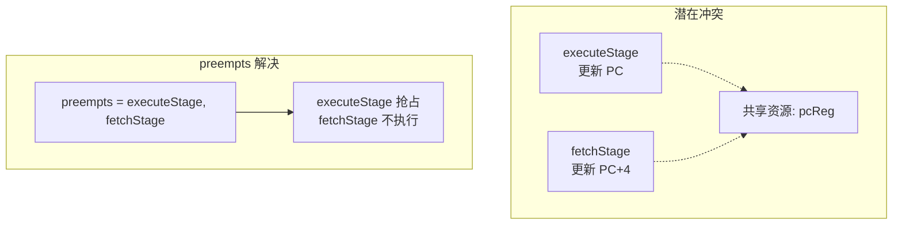
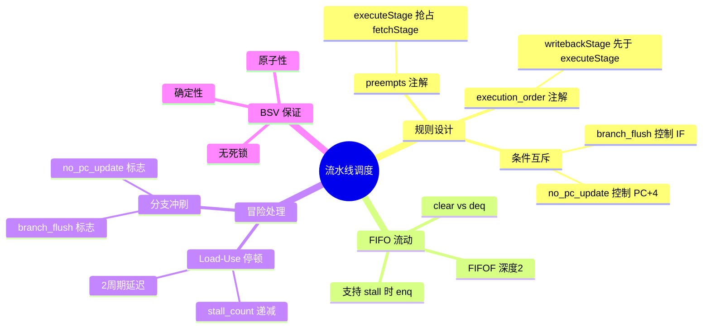

# 流水线调度规则图解

本文档详细说明 BSV 中的流水线调度规则（Rules）及其执行顺序和条件。

## 1. 规则总览



## 2. 规则执行顺序

BSV 编译器使用 `execution_order` 和 `preempts` 注解控制规则执行顺序：



**关键设计**：
- `execution_order`：writebackStage 先于 executeStage
- `preempts`：executeStage 抢占 fetchStage，防止同时更新 PC
- `clearBranchFlush`：在 fetchStage 之后执行

## 3. FIFO 流动图



## 4. 分支冲刷控制

分支跳转时需要冲刷流水线中的错误指令：



### 分支冲刷时序



## 5. Load-Use 停顿时序



## 6. 规则调度矩阵

| 规则 | 执行条件 | 操作的 FIFOF | 关键功能 |
|------|----------|--------------|----------|
| writebackStage | 无条件 | mem2wb (deq) | 释放 WB，更新双缓冲 |
| memoryStage | 无条件 | ex2mem (deq), mem2wb (enq) | 内存访问 |
| executeStage | !stall && id2ex.notEmpty | id2ex (deq/clear), ex2mem (enq) | 执行分支/ALU，前递 |
| decodeStage | !stall | if2id (deq), id2ex (enq) | 解码，冒险检测 |
| decrementStall | stall && count > 0 | id2ex (enq) | stall 递减，插入 NOP |
| clearBranchFlush | branch_flush | - | 清除 branch_flush |
| fetchStage | !stall && !branch_flush | if2id (enq) | 取指，预测 |

## 7. preempts 机制



**关键点**：
- `executeStage` 抢占 `fetchStage`
- 当 `executeStage` 执行时，`fetchStage` 不会同时执行
- 防止 PC 被两个规则同时更新

## 8. 代码实现对照

### fetchStage

```bsv
(* preempts = "executeStage, fetchStage" *)
rule fetchStage (programLoaded && state == RUNNING && !stall_load_use && !branch_flush);
    Addr fetchPC = pcReg;
    // ... BTB/BHT 预测 ...

    if2id.enq(IF_ID_Packet { ... });

    // 只在 branch_flush_done 和 no_pc_update 为 False 时更新 PC
    if (!branch_flush_done && !no_pc_update) begin
        if (take_prediction)
            pcReg <= prediction_target;
        else
            pcReg <= pcReg + 4;
    end
endrule
```

### executeStage

```bsv
(* execution_order = "writebackStage, executeStage" *)
(* preempts = "executeStage, fetchStage" *)
rule executeStage (!stall_load_use && id2ex.notEmpty && ex2mem.notFull);
    // ... 前递逻辑 ...

    if (branch_taken) begin
        pcReg <= actual_target;
        branch_flush <= True;
        no_pc_update <= True;
        if2id.clear;
        id2ex.clear;
    end else begin
        id2ex.deq;
        no_pc_update <= False;
    end
endrule
```

### decrementStall

```bsv
rule decrementStall (stall_load_use && stall_count > 0);
    Bit#(2) new_count = stall_count - 1;
    stall_count <= new_count;
    if (new_count == 0) begin
        stall_load_use <= False;
    end
    id2ex.enq(nopPacket());
endrule
```

## 9. 设计要点总结


